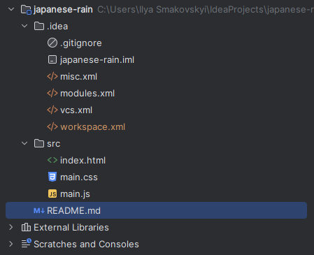
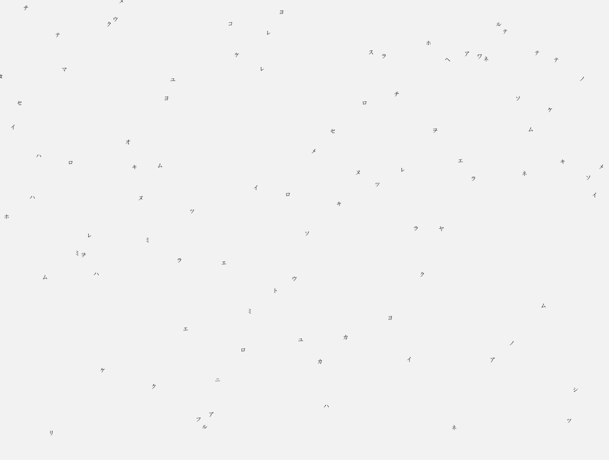

# Matrix Rain Canvas Effect

### This project is a JavaScript animation that creates a "Matrix rain"

    What this project does
    Draws falling characters on a <canvas>
    Each character falls down with a random speed
    Characters are chosen randomly from a string
    Has a trail (fade) effect
    Automatically adapts to browser window resize

### Technologies 
- HTML
- JavaScript
- Canvas API

### Project structure

### Project

The symbols are falling down :)

### How to run

1. **Clone or download the repository:** https://github.com/Iliapp/japanese-rain.git
2. **Open the file:** index.html.(Just double-click it or open it in your browser.)